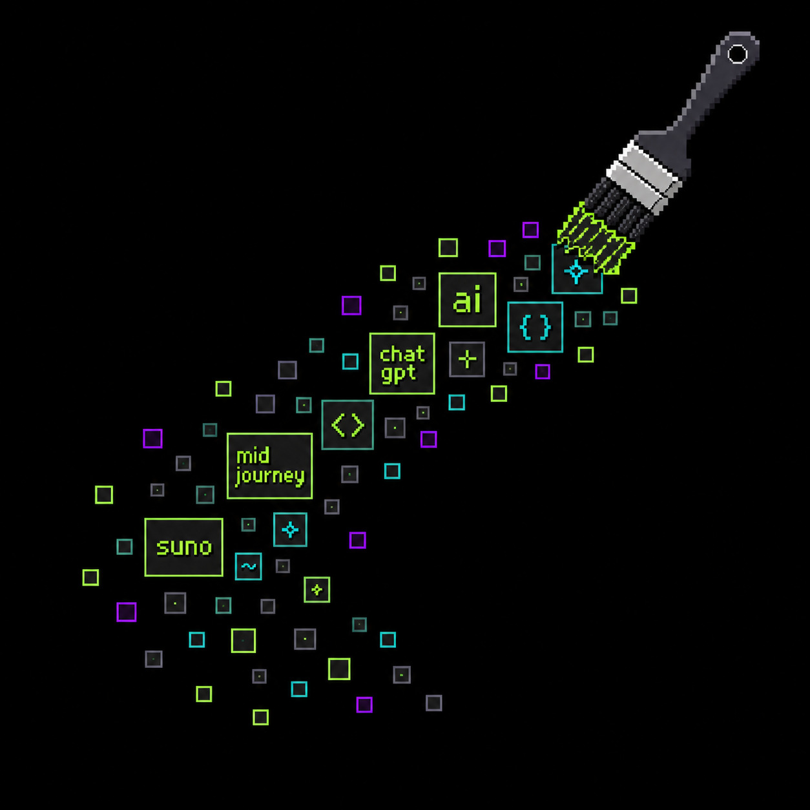
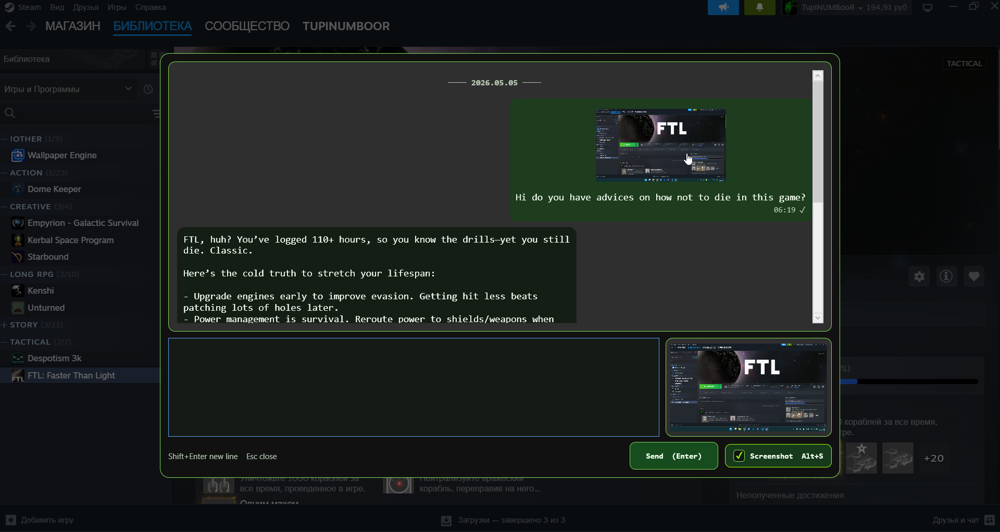
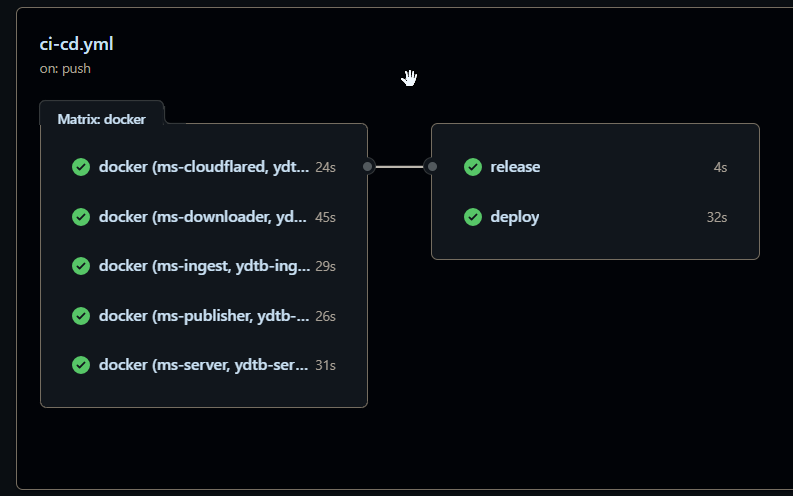
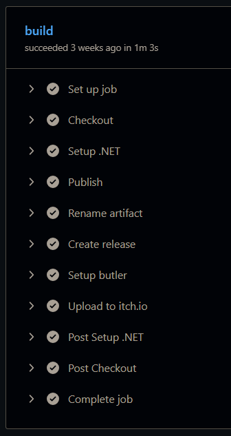
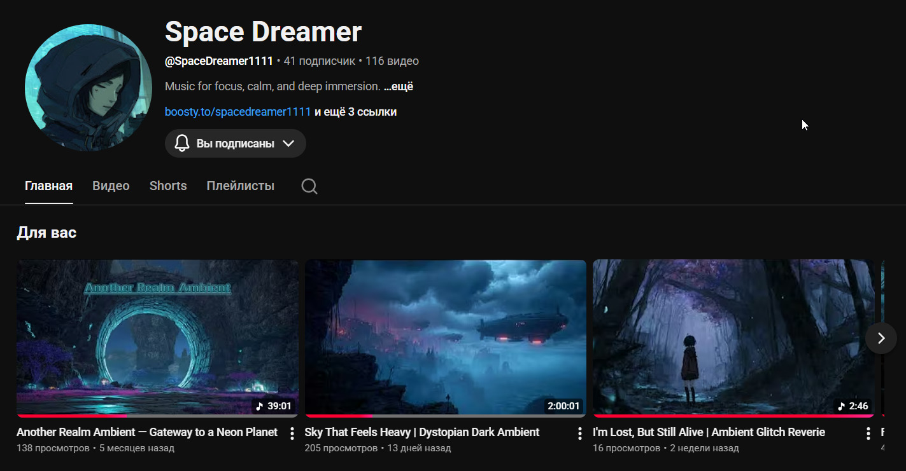
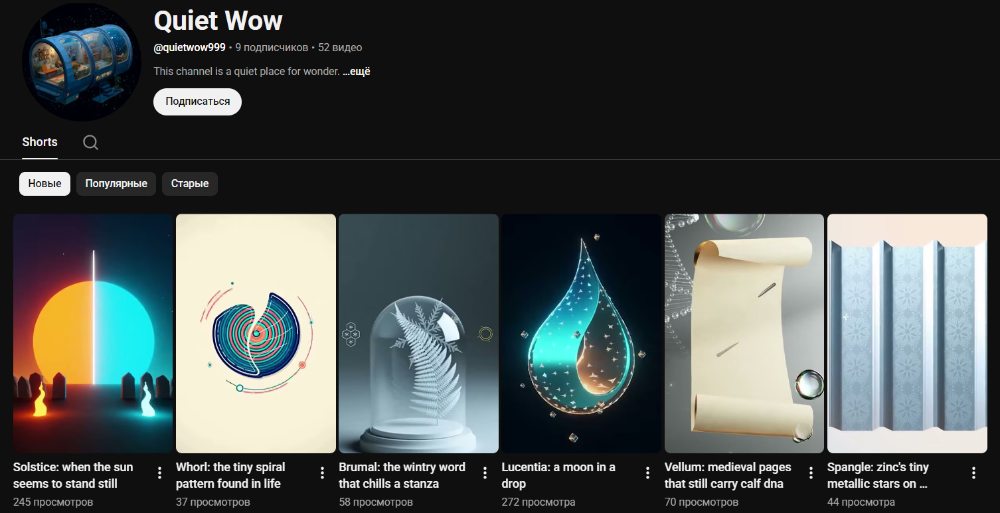
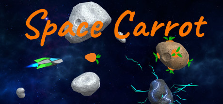
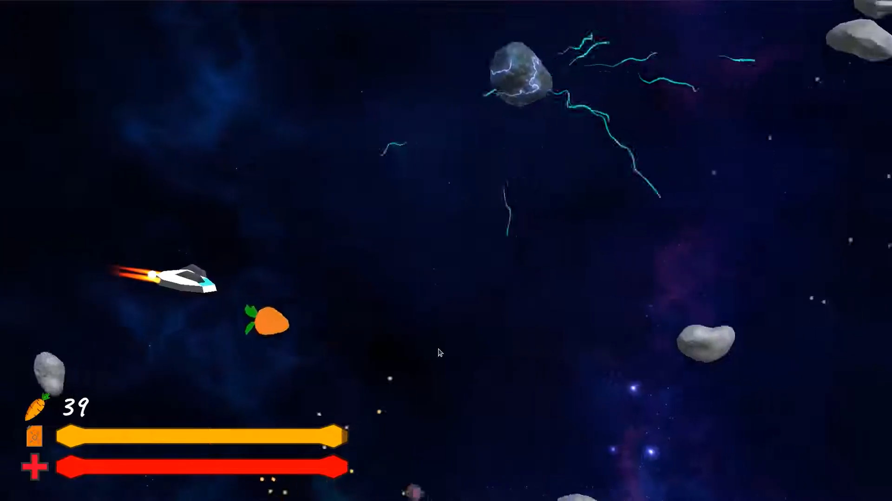
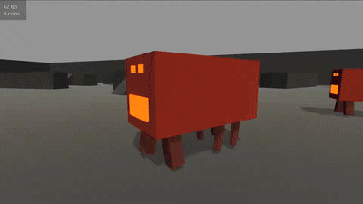

# Me

I make tools, bots, games, videos, pipelines, and whatever else I feel like building — and I ship them.

[GitHub](https://github.com/TupiNUMBooR) | [itch.io](https://tupinumboor.itch.io) | [YouTube](https://www.youtube.com/@SpaceDreamer1111)

# VYRA

VYRA is a minimalist desktop diary overlay for fast screenshots, notes, and optional AI context, so you can capture what matters instantly without breaking your flow

[itch.io](https://tupinumboor.itch.io/vyra) | [GitHub](https://github.com/TupiNUMBooR/VYRA)

Fully automated development pipeline: build → package → publish to itch.io

# YouTube Downloader Telegram Bot

A Telegram bot that downloads YouTube videos using `yt-dlp`, exposes them via a temporary HTTP link, and sends the result back to Telegram

[@ytdlp_202604_bot](https://t.me/ytdlp_202604_bot) | [GitHub](https://github.com/TupiNUMBooR/yt-dlp-tg-bot)

Automated CI/CD pipeline: builds multiple Docker images and deploys them to a configured SSH server

# Klip

Klip is a small desktop pet for Windows that follows your cursor and remembers your clipboard

[itch.io](https://tupinumboor.itch.io/klip) | [GitHub](https://github.com/TupiNUMBooR/pet)

Fully automated development pipeline: build → package → publish to itch.io

# Space Dreamer

Experimental YouTube channel with music, visuals, and edits

Includes:
- AI-generated music and songs (Suno) with AI-generated images (Midjourney)
- long-form ambient tracks
- audio-reactive visuals (Vizzy)
- short edits and memes (CapCut), with voice cloning and AI-assisted visuals (ArtList)
- whatever I feel like uploading

[YouTube](https://www.youtube.com/@SpaceDreamer1111)

Best videos:
- [Patchwork Resurrection - YouTube](https://www.youtube.com/watch?v=4uhRJO3v52U)
- [Cosmic Overdrive - YouTube](https://www.youtube.com/watch?v=Q73PN2ThCbo)
- [Music Is Still Good - YouTube](https://www.youtube.com/watch?v=yqbogGzaNZc)
- [Panic - YouTube](https://www.youtube.com/watch?v=TQ_8J_Ll0iE)
- [Into the Mist — The Forest Rune Awakens - YouTube](https://www.youtube.com/watch?v=IvCzkjfWpLg&t=531s)

# Quiet Wow

My YouTube channel about interesting facts

[YouTube](https://www.youtube.com/@QuietWow999)

Features a fully automated video pipeline:
- ChatGPT script + metadata generation + validation →
- OpenAI TTS narration →
- Sora 2 video generation →
- video assembly →
- YouTube upload

Estimated cost: about $0.50 per video.

Status: shut down, thinking about new content

# Space Carrot

My game on Steam — a completed and shipped commercial project

[Space Carrot on Steam](https://store.steampowered.com/app/1174490/Space_Carrot/)

# Unity Work

A collection of gameplay and prototype work in Unity

[Examples of my work as Unity Developer - YouTube](https://www.youtube.com/watch?v=jdV6eylSV1o)

# Other Projects / Tools

- **[Windows / WSL Scripts](https://github.com/TupiNUMBooR/scripts-windows)** — I use them every day
- **[Run AI Locally](https://github.com/TupiNUMBooR/ai)** — Ollama + Docker
- **[Satisfactory Server](https://github.com/TupiNUMBooR/satisfactory-dedicated)** — Docker setup
- **[Voice AI Bot](https://github.com/TupiNUMBooR/telegram-voice-ai-bot)** — send voice → receive voice
- **[Weather Bot](https://github.com/TupiNUMBooR/froglyn)** — get weather notifications
- **[AI Philosophy (rus)](https://gist.github.com/TupiNUMBooR/65f5df7f49c1f12828df2b26891311ea)** — how I think about development and AI
